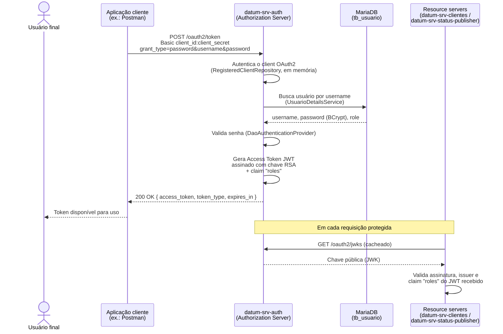
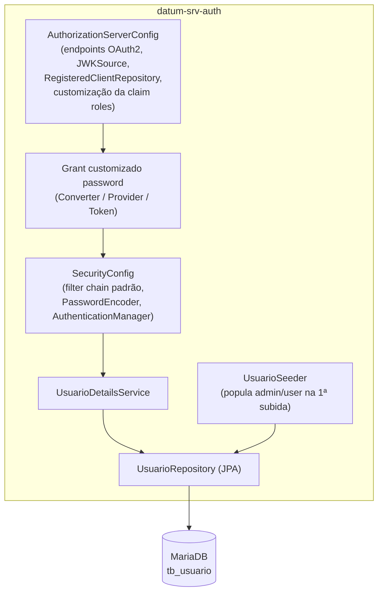

# datum-srv-auth

Authorization Server (OAuth2) da stack **Datum**. Autentica os usuários finais da aplicação e emite os Access Tokens (JWT) usados pelos demais serviços para autorizar suas requisições.

## Função do serviço

O `datum-srv-auth` é o serviço central de identidade da stack Datum. Suas responsabilidades são:

- Expor um **OAuth2 Authorization Server** (Spring Authorization Server), com os endpoints padrão do protocolo (`/oauth2/token`, `/oauth2/jwks`, entre outros).
- Autenticar a **aplicação chamadora** (ex.: Postman) via `client_id`/`client_secret` (HTTP Basic), usando um client OAuth2 registrado em memória.
- Autenticar o **usuário final** via um grant customizado `password` (Resource Owner Password Credentials — removido do padrão a partir do OAuth 2.1, mas reimplementado aqui para uso interno), validando `username`/`password` contra a tabela `tb_usuario` no MariaDB.
- Emitir um **Access Token JWT** assinado com chave RSA, contendo a claim `roles` com o papel do usuário (`ADMIN` ou `USER`), usada pelos demais serviços para decidir se a chamada pode apenas consultar (`USER`) ou também criar/alterar/excluir (`ADMIN`).
- Publicar as chaves públicas em `/oauth2/jwks`, para que os serviços de recurso (resource servers) validem a assinatura dos tokens.

Ele não expõe nenhuma API de negócio própria — sua única função é autenticação e emissão de tokens para o restante da stack.

## Tecnologias

| Categoria | Tecnologia |
|---|---|
| Linguagem / runtime | Java 21 |
| Framework | Spring Boot 3.5.16 |
| Segurança / Auth | Spring Security, Spring Authorization Server (OAuth2), JWT (Nimbus JOSE), chave RSA gerada em memória |
| Persistência | Spring Data JPA / Hibernate |
| Banco de dados | MariaDB (driver `mariadb-java-client`) |
| Build | Maven (via wrapper `mvnw`) |
| Empacotamento / execução | Docker (build multi-stage `eclipse-temurin:21-jdk`) |
| Testes | Spring Boot Test, Spring Security Test |

## Dependências (serviços necessários para funcionar)

| Serviço | Uso | Obrigatório |
|---|---|---|
| **MariaDB** | Armazena a tabela `tb_usuario` (username, senha com hash BCrypt, role). É a fonte de verdade dos usuários autenticados pelo grant `password`. | Sim |

O `datum-srv-auth` **não depende** de RabbitMQ nem de nenhum outro serviço da stack (`datum-srv-clientes`, `datum-srv-score-cliente`, `datum-srv-status-publisher`) para subir e funcionar — a relação com eles é inversa: são eles que dependem do `datum-srv-auth` para validar os tokens que recebem (ver [Consumidores](#consumidores-deste-serviço) abaixo).

Variáveis de ambiente relevantes (ver `docker-compose.yml` na raiz do projeto):

| Variável | Descrição | Default |
|---|---|---|
| `DB_HOST` / `DB_PORT` | Host/porta do MariaDB | `localhost` / `3306` |
| `DB_USERNAME` / `DB_PASSWORD` | Credenciais do banco `datum_db` | `user_datum` / — |
| `AUTH_HOST` / `AUTH_PORT` | Host/porta usados para montar o `issuer` do Authorization Server — precisam bater exatamente com o que os resource servers esperam no `iss` do JWT | `localhost` / `9000` |

### Consumidores deste serviço

Não são dependências de subida, mas fazem parte do desenho da stack: `datum-srv-clientes` e `datum-srv-status-publisher` atuam como *resource servers* e validam, a cada requisição, o JWT emitido aqui (assinatura via `/oauth2/jwks` + claim `roles`).

## Arquitetura

Fluxo de emissão de token (grant customizado `password`) e validação subsequente pelos resource servers da stack:



Componentes internos do serviço:



- **Client OAuth2** (`postman-client`): registrado em memória, representa a aplicação chamadora — não o usuário final.
- **Grant `password`**: implementado em `grant/` (`OAuth2PasswordAuthenticationConverter`, `Provider`, `Token`) porque foi removido do padrão OAuth 2.1 do Spring Authorization Server.
- **Usuários**: persistidos em `tb_usuario` (MariaDB), com senha em BCrypt e `role` (`ADMIN`/`USER`). `UsuarioSeeder` cria os usuários `admin`/`admin123` (ADMIN) e `user`/`user123` (USER) na primeira subida, caso a tabela esteja vazia.
- **Chave de assinatura**: par RSA gerado em memória na inicialização (não persistido) — a cada restart, uma nova chave é gerada e um novo JWKS é publicado.

## Como subir

Este serviço faz parte da stack orquestrada pelo `docker-compose.yml` na raiz do repositório [`projeto-datum`](https://github.com/alexmart001/projeto-datum). Para subir apenas ele (com o MariaDB como dependência):

```bash
docker compose up mariadb datum-srv-auth
```
